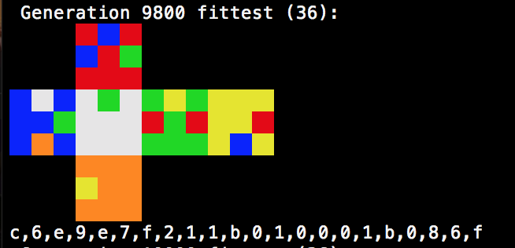

# rubsolv
Genetic algorithm that tries to solve a rubik's cube that I wrote for fun and practice. This is the closest it got to solving a cube:



This was obtained with the current configuration in `config.h` with the following differences:
```
#define IMMEDIATE_REPOP 1
#define CHROMO_LENGTH   22
```
Feel free to toy around with the numbers and if you get a better result, tell me.

## Running
```
git clone
make
./rubsolv
```

Tested with clang-1000.11.45.5 and gcc 6.3.0, compiles and runs without problems.

## TODO list
Things to try in the future to see which yields better results:

- Instead of rewarding based on color, reward based on landing 1 of the 26 pieces at the right spot
- Use a neural net

## License
MIT
